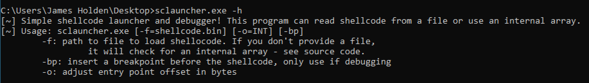

# SCLauncher - Basic Shellcode Tester and Debugger

This program is designed to load 32-bit shellcode and allow for execution or debugging. The provided binary can be found in the `binaries` folder with a SHA 256 of `8fe5bd48daa90fe4be9321244912d23e0ede5010d4ea72a66c66fabe66c03d2e`.



You can view a demo of this tool on [YouTube](#)

## Compiling From Source

This program is intended to be compiled with the C/C++ compiler from Microsoft. You can use the `Developer Command Prompt` after installing the free/community version to compile using `cl`. An example of this command would be:

```cl sclauncher.c```

This will produce the exectuable ```sclauncher.exe```.

## Executing Shellcode From a File

You can use the ```-f``` argument to define a path to a file that contains shellcode. This will be copied into memory and executed. Additionally, you can use the ```-o``` argument to adjust the entry point by X bytes. This allows for shellcode that does not begin execution at the beginning of the binary blob. Finally, ```-bp``` determines if a breakpoint should be inserted before the shellcode. This will be done through a ```0xCC``` byte, which is an INT3. This allows you to run the program  under a debugger, defining the command line arguments as appropriate. Inserting a breakpoint will allow the debugger to interrupt execution before the shellcode is executed. If you are *not* running under a debugger, do not insert a breakpoint as that will cause the program to crash.


## Executing Shellcode From an Internal Array

The source code also allows for the inclusion of shellcode through an internal array, named ```shellcode```. The bytes of shellcode must be copied into the array value and the size of the array adjusted. The program can then be compiled and executed - this mode does not support the ```-f``` argument.

